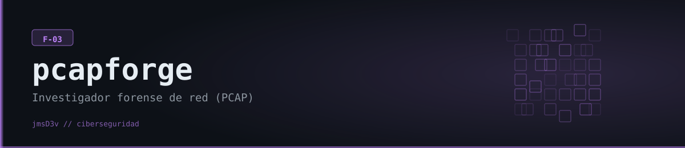

# PCAPForge



**Investigador de forense de red (F-03) — reconstrucción de flujos, detección de escaneos/C2/DGA/SQLi sobre capturas PCAP, con narrativa de incidente por IA.**

## Qué hace

PCAPForge toma un archivo `.pcap`/`.pcapng` y lo parsea con **dpkt** (no con Scapy, ver nota abajo) reconstruyendo flujos TCP/UDP bidireccionales, consultas DNS, requests HTTP y sesiones TLS (extrayendo el SNI del ClientHello sin descifrar nada). Sobre esos datos corre tres motores de detección basados en heurísticas/patrones: uno de flujos (escaneo de puertos, beaconing C2 por regularidad de intervalos, movimiento lateral interno, puertos sospechosos, transferencias grandes salientes, fuerza bruta RDP), uno de DNS (dominios DGA por entropía/ratio de consonantes, túneles DNS, fast-flux, tormenta de NXDOMAIN, TLDs sospechosos) y uno de HTTP (SQLi, XSS, path traversal, webshells, User-Agents de scanners/frameworks de C2, rutas sensibles, fuerza bruta de login). Todos los hallazgos quedan taggeados con técnicas MITRE ATT&CK y, si hay una API key de IA configurada (Anthropic Claude, Google Gemini u OpenAI — se detecta automáticamente cuál), se le pide a la IA que arme una narrativa del incidente, identifique el tipo de actor de amenaza y reconstruya la kill chain.

No requiere conseguir una captura real para probarlo: el comando `demo` genera **en memoria** un `.pcap` sintético (escrito a mano con `struct.pack`, sin librerías de captura) con un escaneo de puertos, DNS a dominios DGA, beaconing HTTP tipo Meterpreter, un intento de SQLi, movimiento lateral por SMB/RDP y una transferencia grande — pensado justamente para demostrar todos los detectores sin depender de una muestra externa.

## Características

- Reconstrucción de flujos TCP/UDP bidireccionales con contador de paquetes, bytes y duración.
- Parseo de DNS (A/AAAA/MX/TXT/PTR/NS/CNAME/SOA) con IPs de respuesta.
- Parseo de HTTP (método, host, path, User-Agent, status code) desde el payload TCP.
- Extracción de SNI de TLS ClientHello (parseo manual del handshake, sin descifrar tráfico).
- **Detector de flujos**: port scan (≥20 puertos distintos desde un mismo origen), beaconing C2 (≥5 conexiones periódicas con coeficiente de variación de intervalo < 0.3), movimiento lateral (≥3 hosts internos por puertos admin: 445/3389/5985/135/139/5900/23), puertos sospechosos (4444, 1337, 31337, 6667, etc.), transferencias > 50 MB a host externo, fuerza bruta RDP (≥10 intentos externos).
- **Detector de DNS**: heurística DGA (entropía de Shannon + ratio de consonantes + ausencia de vocales sobre el label del dominio), túneles DNS (labels > 50 caracteres o > 6 niveles de subdominio), fast-flux (un dominio con ≥5 IPs de respuesta distintas), tormenta de NXDOMAIN, TLDs sospechosos (.tk, .xyz, .top, etc.).
- **Detector de HTTP**: regex de SQLi/XSS/path traversal/webshell sobre la URL, User-Agents de scanners (nikto, sqlmap, nmap...) y de frameworks C2 (meterpreter, cobalt strike, sliver...), acceso a rutas sensibles (`/.env`, `/.git/`, `/wp-config.php`...), fuerza bruta de login por POSTs repetidos.
- Narrativa de incidente por IA (opcional, multi-proveedor): reconstrucción del ataque, tipo de actor de amenaza, kill chain paso a paso y técnicas MITRE — si falla o no hay ninguna key configurada, el análisis heurístico se mantiene intacto.
- Reporte HTML (Jinja2) y export JSON.
- Comandos puntuales `flows` (top flujos por bytes) y `dns` (consultas DNS, con `--suspicious` para filtrar solo las marcadas).

**Nota real de dependencias**: `pyproject.toml` declara `scapy>=2.5.0`, pero **el código no lo usa en ningún lado** — todo el parseo de paquetes (`parsers/pcap_reader.py`) está hecho con `dpkt`. Es peso muerto (y una instalación bastante más pesada de lo necesario); no hace falta Npcap/WinPcap instalado en el sistema para que la herramienta funcione, porque no se abre ninguna interfaz de red ni se captura tráfico en vivo — todo el análisis es sobre archivos `.pcap` ya grabados.

## Requisitos

- Python 3.11+ (probado en este entorno con 3.14.6).
- Sin dependencias de sistema para el análisis de archivos — `dpkt` es Python puro. No hace falta Npcap/libpcap porque PCAPForge no captura tráfico en vivo, solo lee capturas ya existentes.
- Variable de entorno opcional — **cualquiera de estas API keys** habilita la narrativa de incidente con IA (se detecta automáticamente cuál está configurada; sin ninguna, el análisis heurístico funciona igual):
  - `ANTHROPIC_API_KEY` (Claude) — prioridad más alta si hay varias configuradas.
  - `GEMINI_API_KEY` (Google Gemini, tiene tier gratuito) — segunda prioridad.
  - `OPENAI_API_KEY` (OpenAI) — tercera prioridad.

## Instalación

```bash
git clone https://github.com/jmsD3v/pcapforge
cd pcapforge

python -m venv .venv
source .venv/Scripts/activate      # Windows (Git Bash) — en cmd/PowerShell: .venv\Scripts\activate
pip install -e .

cp .env.example .env
# Opcional: agregar UNA de ANTHROPIC_API_KEY / GEMINI_API_KEY / OPENAI_API_KEY en .env
```

Instalación verificada en este entorno (Windows, Python 3.14.6, venv limpio): `pip install -e .` instala sin errores ni conflictos (incluyendo los SDKs `anthropic`, `google-generativeai` y `openai`).

## Uso

No hace falta una captura real para probarlo — `demo` genera un `.pcap` sintético con patrones de ataque (port scan, DGA, C2 beaconing, SQLi, movimiento lateral, exfiltración) y corre el pipeline completo:

```bash
# Demo con PCAP sintético de ataque, sin IA
pcapforge demo --no-ai

# Análisis completo de una captura real
pcapforge analyze captura.pcap
pcapforge analyze captura.pcap --no-ai
pcapforge analyze captura.pcap --output reporte.html
pcapforge analyze captura.pcap --output hallazgos.json --format json

# Top flujos por bytes
pcapforge flows captura.pcap --top 20

# Consultas DNS (todas, o solo las marcadas sospechosas)
pcapforge dns captura.pcap
pcapforge dns captura.pcap --suspicious
```

Comandos ejecutados de verdad durante la verificación (PCAP sintético generado por el propio proyecto, sin capturar tráfico real):

```bash
$ pcapforge demo --no-ai
Analysis complete:  1 critical  10 high  0 medium  11 total findings  (0.02s)
Packets: 113  Flows: 52  DNS: 6  HTTP: 1  Unique src IPs: 5
```

Detectó correctamente el movimiento lateral (192.168.1.50 → 6 hosts internos por SMB/RDP) como CRITICAL, el escaneo de 27 puertos, 6 puertos "suspicious" distintos (4444/6667/8888/9999/31337/1337), actividad DGA y el User-Agent de `sqlmap`. También:

```bash
$ pcapforge flows captura_guardada.pcap --top 5
$ pcapforge dns captura_guardada.pcap --suspicious   # las 6 consultas DGA salieron marcadas
```

## Estructura del proyecto

```
pcapforge/
├── pcapforge/
│   ├── parsers/pcap_reader.py     # dpkt: flujos, DNS, HTTP, SNI de TLS
│   ├── detectors/
│   │   ├── flow_detector.py       # Port scan, beaconing, movimiento lateral, exfil, RDP brute force
│   │   ├── dns_detector.py        # DGA, túneles DNS, fast-flux, NXDOMAIN storm, TLDs sospechosos
│   │   └── http_detector.py       # SQLi, XSS, traversal, webshell, scanner/C2 UA, brute force
│   ├── core/
│   │   ├── analyzer.py            # Pipeline principal de análisis
│   │   └── ai_analyzer.py         # Narrativa + kill chain + MITRE — auto-detecta proveedor (Claude/Gemini/OpenAI)
│   ├── types/network.py           # ConnectionFlow, DnsQuery, HttpRequest, ForensicFinding, PcapSummary
│   ├── report/generator.py + template.html  # Reporte HTML (Jinja2)
│   └── cli/main.py                # CLI (Typer): analyze / flows / dns / demo
├── .env.example
└── pyproject.toml
```

## Aviso legal

Herramienta desarrollada con fines educativos y de portfolio. Analizar capturas de tráfico de redes o sistemas que no son propios, sin autorización explícita del responsable, puede constituir un delito e infringir normativa de privacidad de comunicaciones. Usala únicamente sobre capturas propias o para las que tengas consentimiento explícito. El autor no se hace responsable del uso indebido de esta herramienta.
